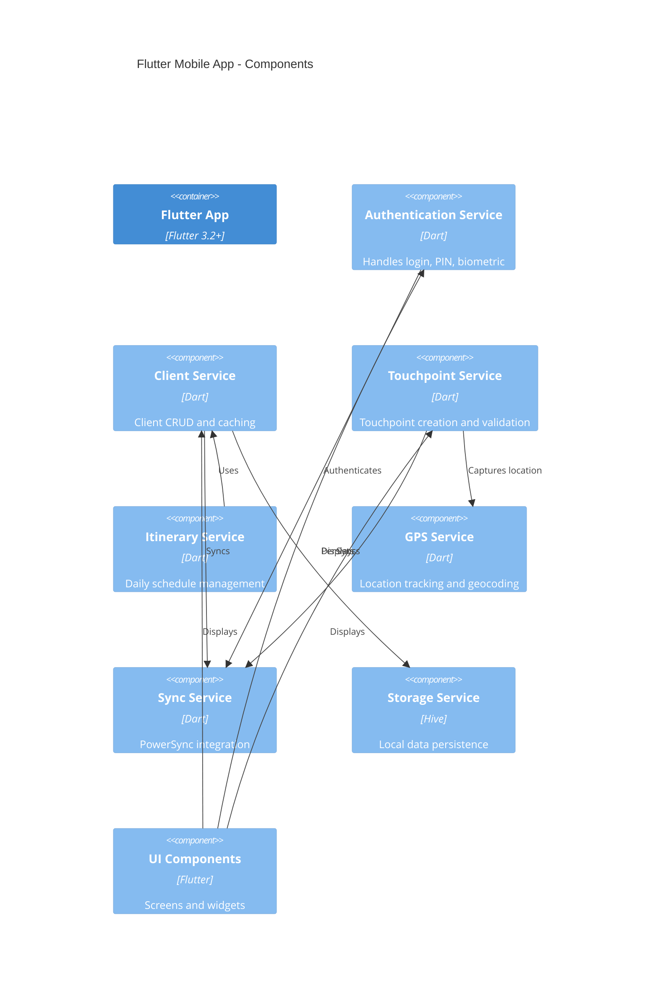
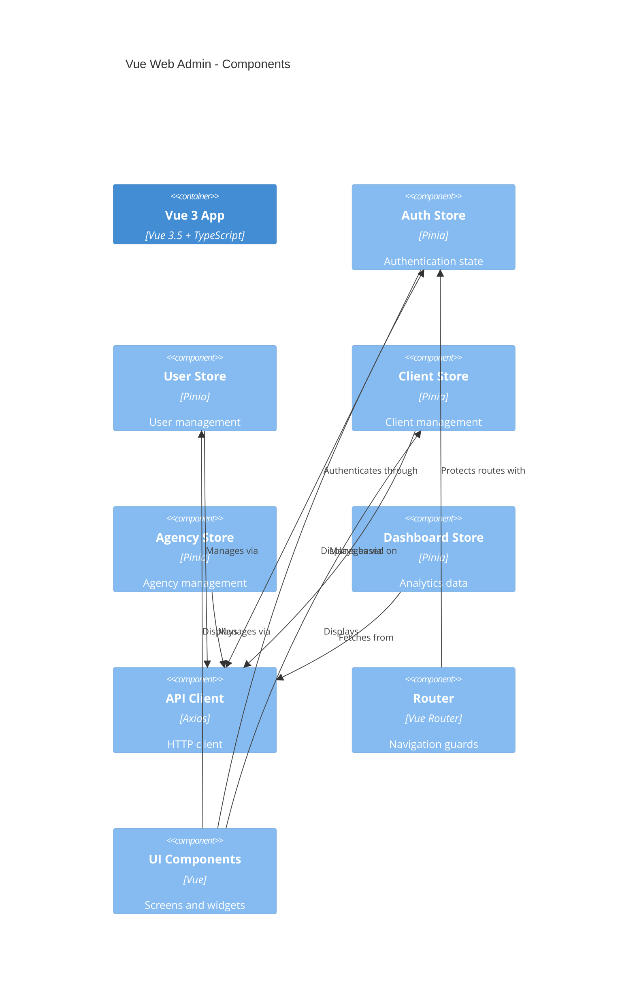
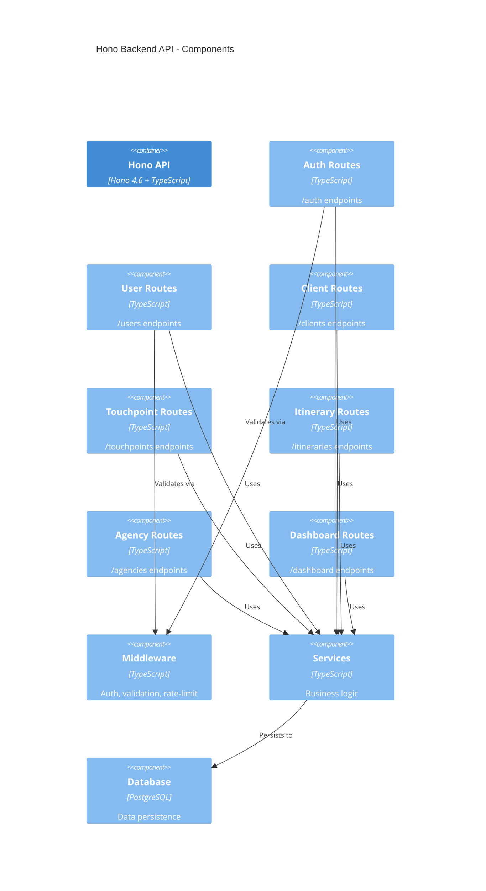

# C4 Model: Components

> **IMU Component Diagrams** - Detailed component breakdown for each container

---

## Flutter Mobile App Components



### Component Details

#### Authentication Service
- **Package:** `features/auth/data/repositories/auth_repository.dart`
- **Responsibilities:**
  - Email/password login
  - PIN setup and validation
  - Biometric authentication
  - Session management
  - Token refresh
- **External Dependencies:** Backend API, flutter_secure_storage, local_auth

#### Client Service
- **Package:** `features/clients/data/repositories/client_repository.dart`
- **Responsibilities:**
  - Client CRUD operations
  - Client search and filtering
  - Offline caching
  - Sync with PowerSync
- **Data Models:** Client, Address, PhoneNumber
- **External Dependencies:** PowerSync SDK, Backend API

#### Touchpoint Service
- **Package:** `features/touchpoints/data/repositories/touchpoint_repository.dart`
- **Responsibilities:**
  - Touchpoint CRUD operations
  - Touchpoint validation (role-based)
  - GPS location capture
  - Photo/audio upload
  - Offline queuing
- **Data Models:** Touchpoint, TouchpointReason, TouchpointStatus
- **External Dependencies:** PowerSync SDK, Backend API, GPS Service

#### GPS Service
- **Package:** `core/services/geolocation_service.dart`
- **Responsibilities:**
  - Location tracking
  - Geocoding (address resolution)
  - Accuracy validation
  - Permission handling
- **External Dependencies:** geolocator, geocoding

---

## Vue Web Admin Components



### Component Details

#### Auth Store
- **File:** `stores/auth.ts`
- **Responsibilities:**
  - Login/logout
  - Token management
  - User session
  - Permission checking
- **State:** user, token, isAuthenticated
- **Actions:** login, logout, refreshToken
- **External Dependencies:** Backend API

#### Client Store
- **File:** `stores/clients.ts`
- **Responsibilities:**
  - Client list management
  - Client CRUD operations
  - Import from CSV
  - Search and filter
- **State:** clients, loading, error, pagination
- **Actions:** fetchClients, createClient, updateClient, importClients
- **External Dependencies:** Backend API

#### API Client
- **File:** `lib/api-client.ts`
- **Responsibilities:**
  - HTTP requests
  - Token injection
  - Error handling
  - Token refresh
  - Response formatting
- **External Dependencies:** Axios, Backend API

---

## Hono Backend API Components



### Component Details

#### Auth Routes
- **File:** `src/routes/auth.ts`
- **Endpoints:**
  - `POST /auth/login` - User login
  - `POST /auth/refresh` - Refresh token
  - `POST /auth/logout` - User logout
  - `POST /auth/verify-token` - Verify PowerSync token
  - `POST /auth/powersync-token` - Get PowerSync JWT
- **Responsibilities:** Authentication, JWT generation
- **External Dependencies:** PostgreSQL, bcrypt, JWT

#### Client Routes
- **File:** `src/routes/clients.ts`
- **Endpoints:**
  - `GET /clients` - List clients (paginated)
  - `GET /clients/:id` - Get client by ID
  - `POST /clients` - Create client
  - `PUT /clients/:id` - Update client
  - `DELETE /clients/:id` - Delete client
  - `GET /clients/search` - Search clients
  - `POST /clients/import` - Import from CSV
- **Responsibilities:** Client CRUD, import/export
- **External Dependencies:** PostgreSQL, S3/NAS

#### Touchpoint Routes
- **File:** `src/routes/touchpoints.ts`
- **Endpoints:**
  - `GET /touchpoints` - List touchpoints
  - `GET /touchpoints/:id` - Get touchpoint by ID
  - `POST /touchpoints` - Create touchpoint
  - `PUT /touchpoints/:id` - Update touchpoint
  - `DELETE /touchpoints/:id` - Delete touchpoint
  - `GET /touchpoints/client/:clientId` - Get client touchpoints
- **Validation:**
  - Caravan: Visit touchpoints only (1, 4, 7)
  - Tele: Call touchpoints only (2, 3, 5, 6)
  - Admin: All touchpoints
- **Responsibilities:** Touchpoint CRUD, validation, GPS tracking

#### Middleware
- **Files:** `src/middleware/*.ts`
- **Components:**
  - `auth.ts` - JWT validation
  - `rate-limit.ts` - Rate limiting
  - `audit.ts` - Audit logging
- **Responsibilities:** Request validation, authentication, logging

#### Services
- **Files:** `src/services/*.ts`
- **Components:**
  - `analytics.ts` - Dashboard analytics
  - `email.ts` - Email notifications
  - `gps-validation.ts` - GPS validation
  - `storage.ts` - File upload management
- **Responsibilities:** Business logic, external integrations

---

## Database Components

```mermaid
C4Component
    title PostgreSQL Database - Components

    Container(db, "PostgreSQL", "PostgreSQL 15")

    Component(db_users, "Users Table", "Table", "User accounts")
    Component(db_clients, "Clients Table", "Table", "Client records")
    Component(db_touchpoints, "Touchpoints Table", "Table", "Touchpoint records")
    Component(db_itineraries, "Itineraries Table", "Table", "Daily schedules")
    Component(db_agencies, "Agencies Table", "Table", "Organization structure")
    Component(db_approvals, "Approvals Table", "Table", "Approval workflow")
    Component(db_attendance, "Attendance Table", "Table", "Field agent attendance")
    Component(db_audit, "Audit Logs Table", "Table", "System audit trail")

    Rel(api_services, db_users, "Queries")
    Rel(api_services, db_clients, "Queries")
    Rel(api_services, db_touchpoints, "Queries")
    Rel(api_services, db_itineraries, "Queries")
    Rel(api_services, db_agencies, "Queries")
    Rel(api_services, db_approvals, "Queries")
    Rel(api_services, db_attendance, "Queries")
    Rel(api_middleware, db_audit, "Writes to")
```

### Table Details

#### users
- **Columns:** id, email, password_hash, first_name, last_name, role, agency_id, is_active, created_at, updated_at
- **Indexes:** email (unique), agency_id
- **Relationships:** has_many touchpoints, belongs_to agency

#### clients
- **Columns:** id, first_name, middle_name, last_name, client_type, product_type, market_type, pension_type, status, assigned_to, agency_id, created_at, updated_at
- **Indexes:** status, assigned_to, agency_id
- **Relationships:** has_many touchpoints, has_many addresses, has_many phone_numbers, belongs_to user (assigned_to)

#### touchpoints
- **Columns:** id, client_id, user_id, touchpoint_number, type, reason, status, date, photo_path, audio_path, location_data, time_in, time_in_gps_lat, time_in_gps_lng, time_in_gps_address, time_out, time_out_gps_lat, time_out_gps_lng, time_out_gps_address, created_at
- **Indexes:** client_id, user_id, date, status
- **Relationships:** belongs_to client, belongs_to user

#### itineraries
- **Columns:** id, user_id, date, clients (JSON), status, created_at
- **Indexes:** user_id, date
- **Relationships:** belongs_to user

---

## Component Interactions

### Authentication Flow

```
[Mobile UI] → [Auth Service] → [API Client] → [Auth Routes]
                                                    ↓
                                               [JWT Service]
                                                    ↓
                                               [Users Table]
```

### Touchpoint Creation Flow

```
[Touchpoint UI] → [Touchpoint Service] → [Validation Service]
                                            ↓
                                        [GPS Service]
                                            ↓
                                    [PowerSync SDK] (local save)
                                            ↓
                                    [Backend API] (sync)
                                            ↓
                                      [Touchpoints Table]
```

### Client Sync Flow

```
[PowerSync SDK] ← → [Backend API] ← → [Clients Table]
       ↑                                    ↓
[Client Service]                      [PostgreSQL]
       ↑
[Client UI]
```

---

## Technology Stack by Component

### Mobile Components
| Component | Technology | Purpose |
|-----------|------------|---------|
| **UI** | Flutter Widgets | User interface |
| **State** | Riverpod Providers | Reactive state |
| **Navigation** | go_router | Declarative routing |
| **Storage** | Hive | Local persistence |
| **Sync** | PowerSync SDK | Data synchronization |
| **Network** | Dio | HTTP client |
| **Location** | geolocator | GPS tracking |

### Web Components
| Component | Technology | Purpose |
|-----------|------------|---------|
| **UI** | Vue 3 Components | User interface |
| **State** | Pinia Stores | Reactive state |
| **Routing** | Vue Router | Navigation |
| **Network** | Axios | HTTP client |
| **Validation** | Zod | Schema validation |
| **UI Library** | HeadlessUI + Tailwind | Components |

### Backend Components
| Component | Technology | Purpose |
|-----------|------------|---------|
| **API** | Hono | Web framework |
| **Validation** | Zod | Schema validation |
| **Auth** | JWT (RS256) | Authentication |
| **Database** | pg (node-postgres) | PostgreSQL driver |
| **Password** | bcrypt | Password hashing |

---

## Component Deployment

### Mobile Deployment
```
Flutter App → Compiled → App Store / Play Store
             ↓
         User Device
```

### Web Deployment
```
Vue App → Built → Static Files → CDN → Browser
```

### Backend Deployment
```
Hono API → Compiled → Node.js Server → DigitalOcean → Users
```

---

**Last Updated:** 2026-04-02
