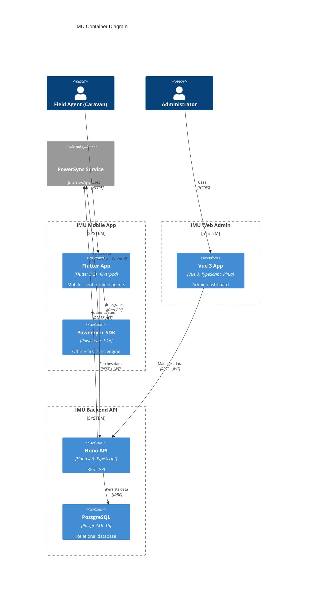

# C4 Model: Containers

> **IMU Container Diagram** - Shows the major containers within the IMU system

---

## Container Diagram



---

## Container Details

### IMU Mobile App

#### Flutter App
- **Technology:** Flutter 3.2+, Dart SDK >=3.2.0
- **Architecture:** Feature-based with clean architecture
- **State Management:** Riverpod 2.0 + flutter_hooks
- **Navigation:** go_router 13.0
- **Local Storage:** Hive 2.2 (legacy), PowerSync 1.15 (current)
- **Responsibilities:**
  - User authentication (email/password → PIN → biometric)
  - Client management (list, detail, create, update)
  - Touchpoint creation (visit/call with GPS, photos, audio)
  - Itinerary management (daily schedule)
  - Offline-first data synchronization
  - Map display and navigation
- **Communication:** REST API to backend, PowerSync SDK for sync

#### PowerSync SDK
- **Technology:** PowerSync Flutter SDK 1.15
- **Purpose:** Offline-first data synchronization
- **Features:**
  - Local SQLite database
  - Automatic background sync
  - Conflict resolution (last-write-wins)
  - Query observation (reactive queries)
- **Schema:** Synchronized tables (clients, users, touchpoints, etc.)
- **Authentication:** RS256 JWT tokens from backend

---

### IMU Web Admin

#### Vue 3 App
- **Technology:** Vue 3.5, TypeScript 5.6, Vite 6.0
- **State Management:** Pinia 2.2
- **Routing:** Vue Router 4.4
- **UI Components:** HeadlessUI Vue + Tailwind CSS 3.4
- **Data Tables:** TanStack Vue Table 8.20
- **Validation:** Zod 3.24
- **Responsibilities:**
  - User management (CRUD, roles, permissions)
  - Client management (import, assign, manage)
  - Agency and group management
  - Dashboard and analytics
  - Reports and exports
  - System configuration
- **Communication:** REST API to backend

---

### IMU Backend API

#### Hono API
- **Technology:** Hono 4.6, TypeScript 5.7, Node.js
- **Architecture:** Route-based with middleware
- **Authentication:** JWT (RS256) with bcrypt password hashing
- **Validation:** Zod schemas for request/response
- **Responsibilities:**
  - Authentication and authorization
  - CRUD operations for all entities
  - Business logic enforcement
  - PowerSync JWT generation
  - GPS validation
  - Email notifications
  - File upload (S3/NAS)
  - Analytics and reporting
- **Routes:**
  - `/auth` - Authentication endpoints
  - `/users` - User management
  - `/clients` - Client CRUD
  - `/touchpoints` - Touchpoint CRUD
  - `/itineraries` - Itinerary management
  - `/agencies` - Agency management
  - `/approvals` - Approval workflow
  - `/dashboard` - Analytics data
  - And 10+ more route groups

#### PostgreSQL Database
- **Technology:** PostgreSQL 15
- **Connection:** Direct connection from Hono API
- **Schema:**
  - `users` - User accounts and profiles
  - `clients` - Client records
  - `touchpoints` - Client interactions
  - `itineraries` - Daily schedules
  - `agencies` - Organization structure
  - `approvals` - Approval workflow
  - `attendance` - Field agent attendance
  - `audit_logs` - System audit trail
  - And 10+ more tables
- **Features:**
  - Indexes on frequently queried columns
  - Foreign key constraints
  - Check constraints for data validation
  - Timestamps for auditing

---

## Container Interactions

### Authentication Flow
```
[Field Agent] → [Mobile App] → [Backend API] → [PostgreSQL]
     ↓                ↓              ↓              ↓
  Enter PIN      Validate JWT    Verify User   Query User
                  Generate JWT    Issue JWT     Return User
```

### Data Sync Flow
```
[Field Agent] → [Mobile App] → [PowerSync SDK] → [PowerSync Service]
                                                ↓
                                         [Backend API] → [PostgreSQL]
```

### Touchpoint Creation Flow
```
[Field Agent] → [Mobile App] → [PowerSync SDK] (local save)
                                    ↓
                            [PowerSync Service] (sync)
                                    ↓
                            [Backend API] (validate)
                                    ↓
                            [PostgreSQL] (persist)
```

---

## Technology Stack Summary

### Mobile App
| Layer | Technology |
|-------|------------|
| **Framework** | Flutter 3.2+ |
| **Language** | Dart >=3.2.0 |
| **State** | Riverpod 2.0 |
| **Navigation** | go_router 13.0 |
| **Storage** | Hive 2.2, PowerSync 1.15 |
| **Network** | Dio 5.7 |
| **Maps** | Mapbox, Geolocator |
| **Auth** | flutter_secure_storage, local_auth |

### Web Admin
| Layer | Technology |
|-------|------------|
| **Framework** | Vue 3.5 |
| **Language** | TypeScript 5.6 |
| **Build** | Vite 6.0 |
| **State** | Pinia 2.2 |
| **Routing** | Vue Router 4.4 |
| **UI** | HeadlessUI + Tailwind |
| **Tables** | TanStack Vue Table |
| **Validation** | Zod 3.24 |

### Backend API
| Layer | Technology |
|-------|------------|
| **Framework** | Hono 4.6 |
| **Language** | TypeScript 5.7 |
| **Runtime** | Node.js |
| **Database** | PostgreSQL 15 |
| **Driver** | pg (node-postgres) 8.13 |
| **Auth** | JWT (RS256), bcrypt |
| **Validation** | Zod 3.24 |
| **Testing** | Vitest 4.1 |

---

## Deployment Architecture

### Development Environment
```
[Local Machine]
  ├─ Mobile App: Flutter run on device/emulator
  ├─ Web Admin: Vite dev server (localhost:4002)
  └─ Backend: tsx watch (localhost:4000)

[Local Database]
  └─ PostgreSQL: localhost:5432

[External Services]
  ├─ PowerSync: Development instance
  └─ Mapbox: Development token
```

### Production Environment
```
[DigitalOcean App Platform]
  ├─ Backend API: Hono server
  ├─ Web Admin: Static files (CDN)
  └─ PostgreSQL: Managed database

[PowerSync Cloud]
  └─ Production sync service

[Mobile Apps]
  ├─ iOS: App Store
  └─ Android: Play Store
```

---

## Data Synchronization

### Sync Architecture
```
┌─────────────────┐
│  Mobile App     │
│  (PowerSync)    │
└────────┬────────┘
         │ PowerSync Protocol
         ↓
┌─────────────────┐
│ PowerSync Cloud │
│   (JourneyApps) │
└────────┬────────┘
         │ Webhook + JWT
         ↓
┌─────────────────┐
│  Backend API    │
│  (Hono)         │
└────────┬────────┘
         │ SQL
         ↓
┌─────────────────┐
│   PostgreSQL    │
└─────────────────┘
```

### Sync Features
- **Bidirectional:** Mobile ↔ Cloud
- **Conflict Resolution:** Last-write-wins
- **Background Sync:** Automatic when connected
- **Incremental:** Only sync changed data
- **Secure:** RS256 JWT authentication

---

## Security Architecture

### Authentication Layers
```
1. Mobile App Layer
   ├─ Email/password login
   ├─ 6-digit PIN (subsequent)
   └─ Biometric (optional)

2. API Layer
   ├─ JWT token (RS256)
   ├─ Middleware validation
   └─ Role-based access control

3. Database Layer
   ├─ Connection pooling
   ├─ User-based permissions
   └─ Audit logging
```

### Authorization Model
- **Roles:** Admin, Area Manager, Assistant Area Manager, Caravan, Tele
- **Permissions:** CRUD operations per entity
- **Scope:** Geographic and organizational boundaries

---

**Last Updated:** 2026-04-02
