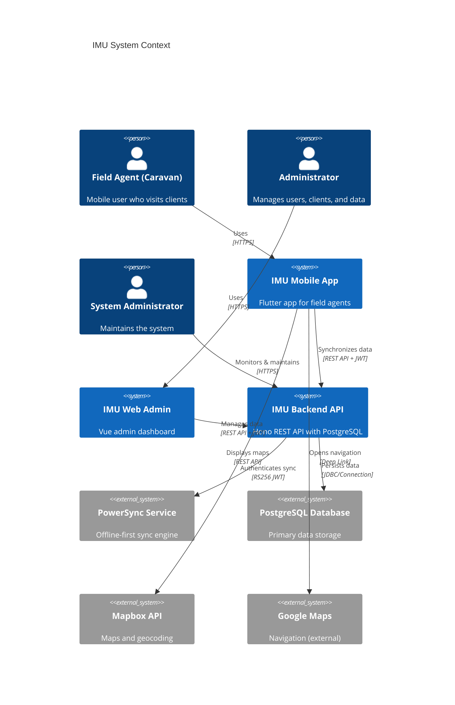

# C4 Model: System Context

> **IMU System Context Diagram** - Shows the IMU system in its environment

---

## System Context



---

## Actors

### Field Agent (Caravan)
- **Role:** Mobile user who conducts client visits
- **Responsibilities:**
  - Manage assigned clients
  - Create touchpoints during visits
  - Track GPS location for visits
  - Sync data offline
- **Access:** Mobile app only

### Administrator
- **Role:** Manages system data and configuration
- **Responsibilities:**
  - Manage users and roles
  - Import and manage clients
  - View reports and analytics
  - Configure system settings
- **Access:** Web admin dashboard

### System Administrator
- **Role:** Maintains technical infrastructure
- **Responsibilities:**
  - Deploy and monitor backend
  - Manage database
  - Configure PowerSync
  - Handle technical issues
- **Access:** Backend API, infrastructure

---

## External Systems

### PowerSync Service
- **Type:** Cloud service (JourneyApps)
- **Purpose:** Offline-first data synchronization
- **Protocol:** PowerSync SDK with RS256 JWT authentication
- **Data:** Synchronizes client, touchpoint, and user data
- **Owner:** IMU project

### PostgreSQL Database
- **Type:** Relational database
- **Purpose:** Primary data persistence
- **Schema:** clients, users, touchpoints, itineraries, approvals, etc.
- **Access:** Direct connection from backend

### Mapbox API
- **Type:** Third-party API
- **Purpose:** Map display and geocoding
- **Protocol:** REST API
- **Authentication:** Access token
- **Usage:** Mobile app displays client locations on maps

### Google Maps
- **Type:** Third-party app (external)
- **Purpose:** Turn-by-turn navigation
- **Protocol:** Deep links (app-to-app)
- **Usage:** Mobile app opens Google Maps for navigation

---

## Key Interactions

### Field Agent Workflow
```
1. Field Agent opens IMU Mobile App
2. Authenticates with email/password → PIN
3. Views assigned clients for today
4. Navigates to client location (Google Maps)
5. Creates touchpoint during visit
6. Syncs data via PowerSync (background)
```

### Administrator Workflow
```
1. Administrator opens IMU Web Admin
2. Authenticates with email/password
3. Imports clients from CSV
4. Assigns clients to field agents
5. Views reports and analytics
6. Configures system settings
```

### Data Sync Flow
```
1. Field Agent creates touchpoint (offline)
2. PowerSync queues change locally
3. When connected, PowerSync syncs to service
4. Backend validates and persists to PostgreSQL
5. Changes propagate to other clients
```

---

## Security Boundaries

### Trust Boundaries

**Internal Systems (Full Trust):**
- IMU Mobile App
- IMU Web Admin
- IMU Backend API

**External Systems (Limited Trust):**
- PowerSync Service (JWT authenticated)
- PostgreSQL Database (direct connection)

**Third-Party Services (No Trust):**
- Mapbox API (access token)
- Google Maps (deep links only)

### Authentication

| System | Auth Method | Token Type | Scope |
|--------|-------------|------------|-------|
| Mobile → Backend | JWT | RS256 | User-specific |
| Web → Backend | JWT | RS256 | User-specific |
| Mobile → PowerSync | JWT | RS256 | Sync-specific |
| Backend → PowerSync | JWT | RS256 | Service token |

---

## Data Flow

### Client Data Flow
```
[Admin] → [Web Admin] → [Backend API] → [PostgreSQL]
                                              ↓
                                        [PowerSync Service]
                                              ↓
[Field Agent] ← [Mobile App] ← [PowerSync SDK] ←
```

### Touchpoint Data Flow
```
[Field Agent] → [Mobile App] → [PowerSync SDK]
                                    ↓
                            [PowerSync Service]
                                    ↓
                            [Backend API] → [PostgreSQL]
```

---

## Geographic Distribution

| Component | Location | Notes |
|-----------|----------|-------|
| **Mobile App** | User device (Philippines) | Offline-first |
| **Web Admin** | Browser (anywhere) | Requires internet |
| **Backend API** | Cloud (DigitalOcean) | Always available |
| **PostgreSQL** | Cloud (DigitalOcean) | Managed database |
| **PowerSync** | Cloud (JourneyApps) | Global service |

---

## Compliance & Privacy

### Data Privacy
- **Personal Data:** Names, addresses, phone numbers
- **Location Data:** GPS coordinates for visits
- **Access Control:** Role-based (Caravan, Tele, Admin)
- **Data Retention:** 7-day local data retention on mobile

### Security Measures
- **Encryption:** JWT tokens, HTTPS everywhere
- **Authentication:** RS256 signatures (more secure than HS256)
- **Authorization:** Role-based access control (RBAC)
- **Audit Logging:** All actions logged for compliance

---

## SLA Considerations

| Component | Availability | Latency | Notes |
|-----------|--------------|---------|-------|
| **Mobile App** | 99%+ (offline-capable) | < 100ms local | Works offline |
| **Web Admin** | 99%+ | < 500ms API | Requires internet |
| **Backend API** | 99.9% | < 200ms p95 | Critical path |
| **PowerSync** | 99.9% | < 1s sync | Background sync |

---

**Last Updated:** 2026-04-02
