# Data Flows

> **IMU Data Flow Diagrams** - How data moves through the system

---

## Authentication Data Flow

### Login Flow

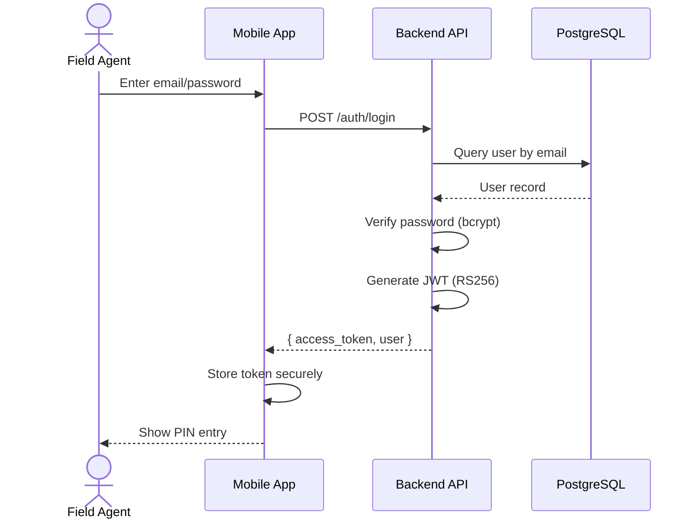

### PIN Entry Flow

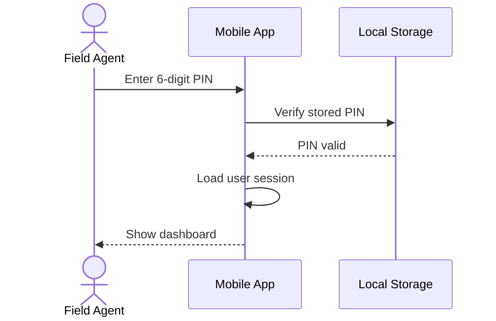

---

## Permission Data Flow

### Permission Fetching Flow

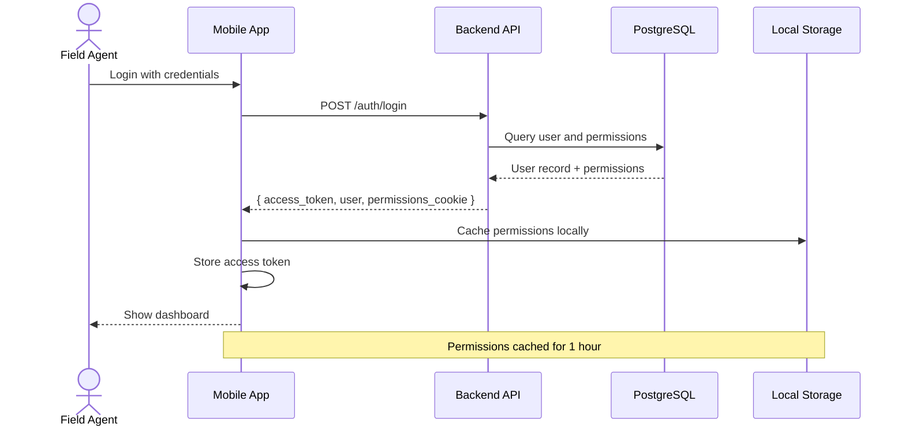

### Permission Check Flow

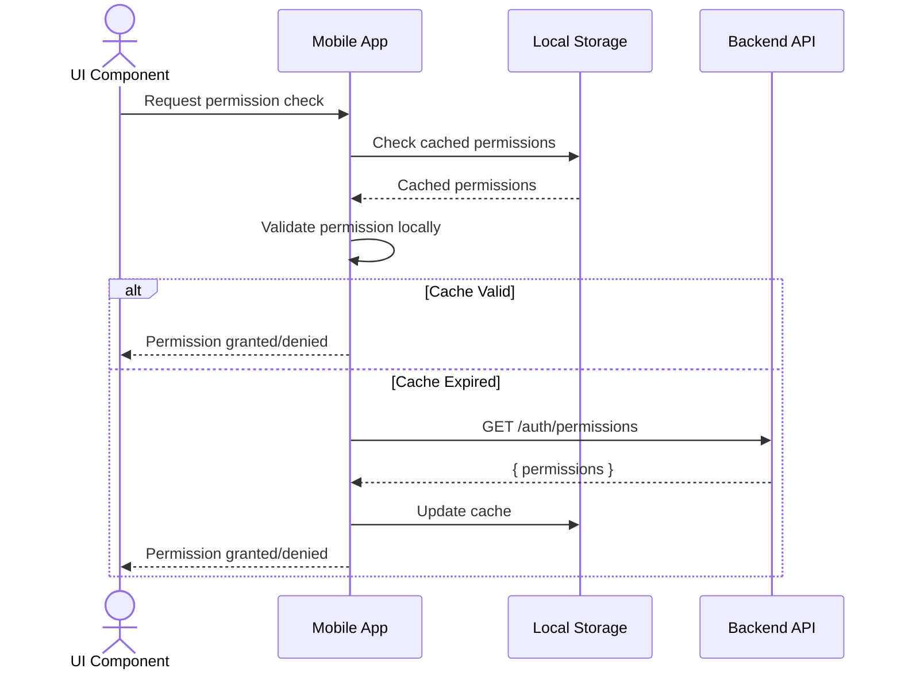

---

## Area Filter Data Flow

### User Locations Fetching Flow

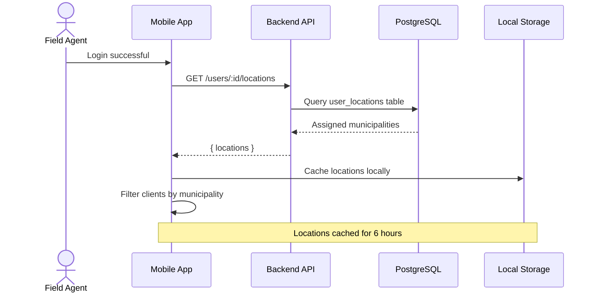

### Area-Based Client Filtering

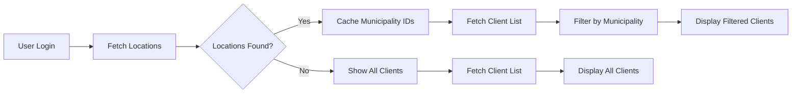

---

## Client Data Flow

### Client Sync Flow

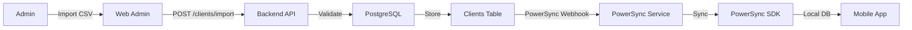

### Client Creation Flow

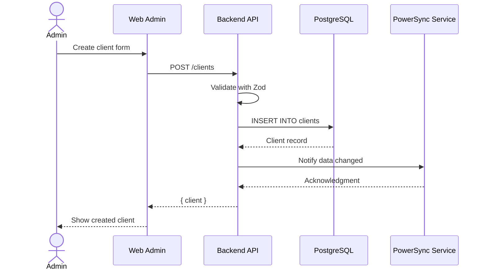

---

## Touchpoint Data Flow

### Touchpoint Creation (Mobile - Online)

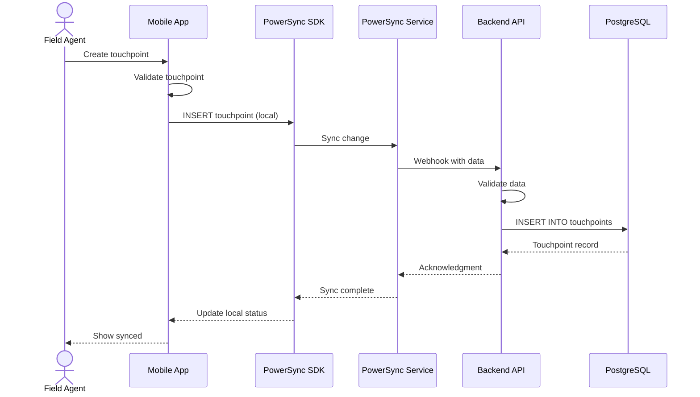

### Touchpoint Creation (Mobile - Offline)

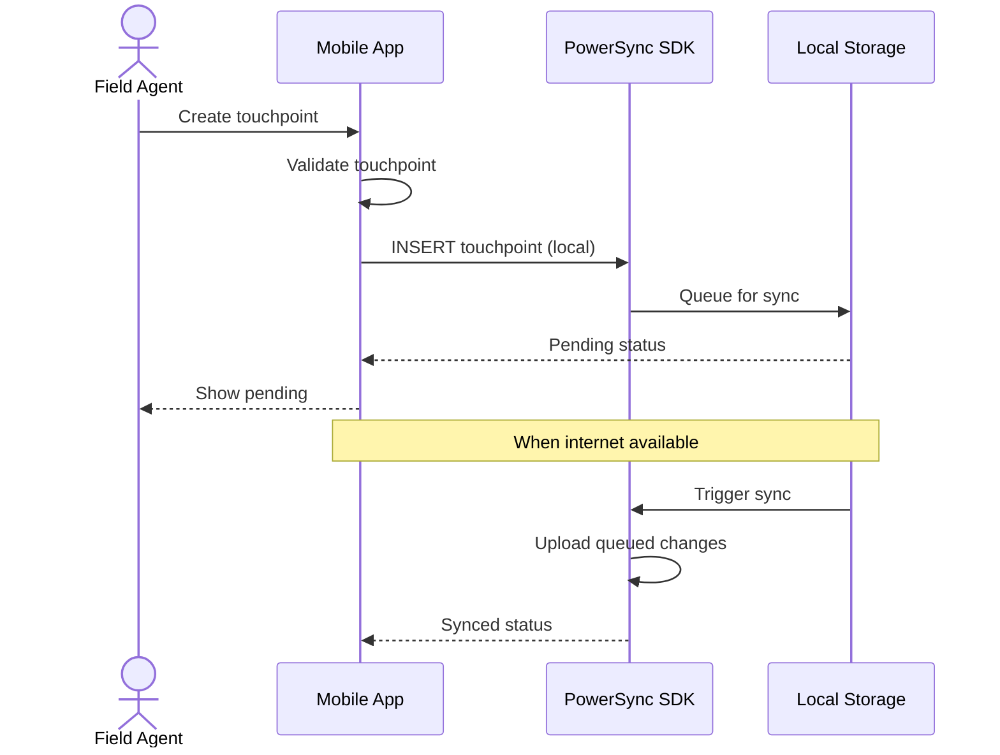

### Touchpoint Creation (Web - Tele)

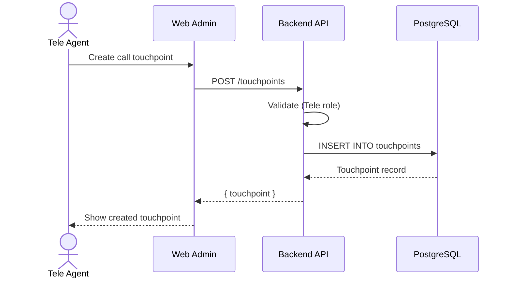

---

## Data Synchronization Flow

### Bidirectional Sync Flow

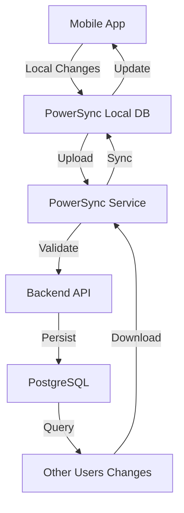

### Sync Conflict Resolution

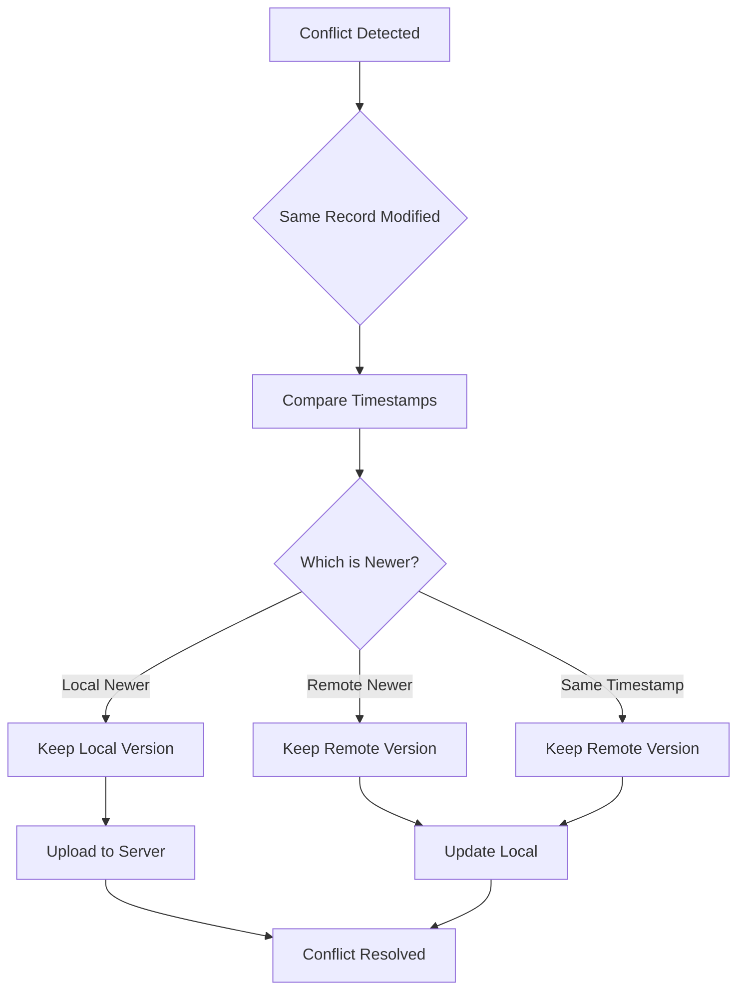

---

## GPS Data Flow

### Location Capture Flow

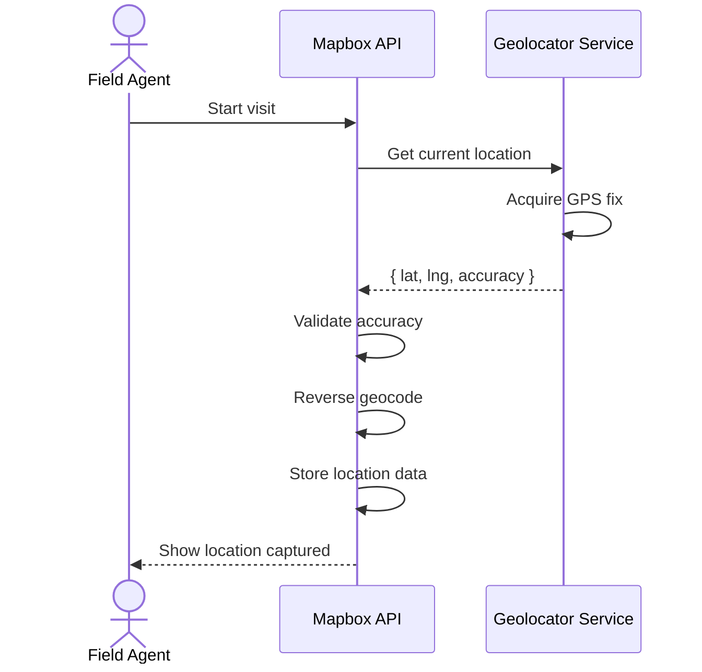

### Geocoding Flow

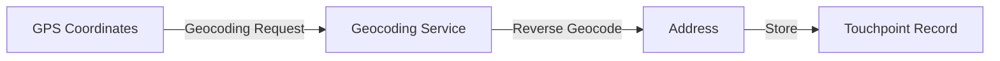

---

## File Upload Flow

### Image Upload Flow

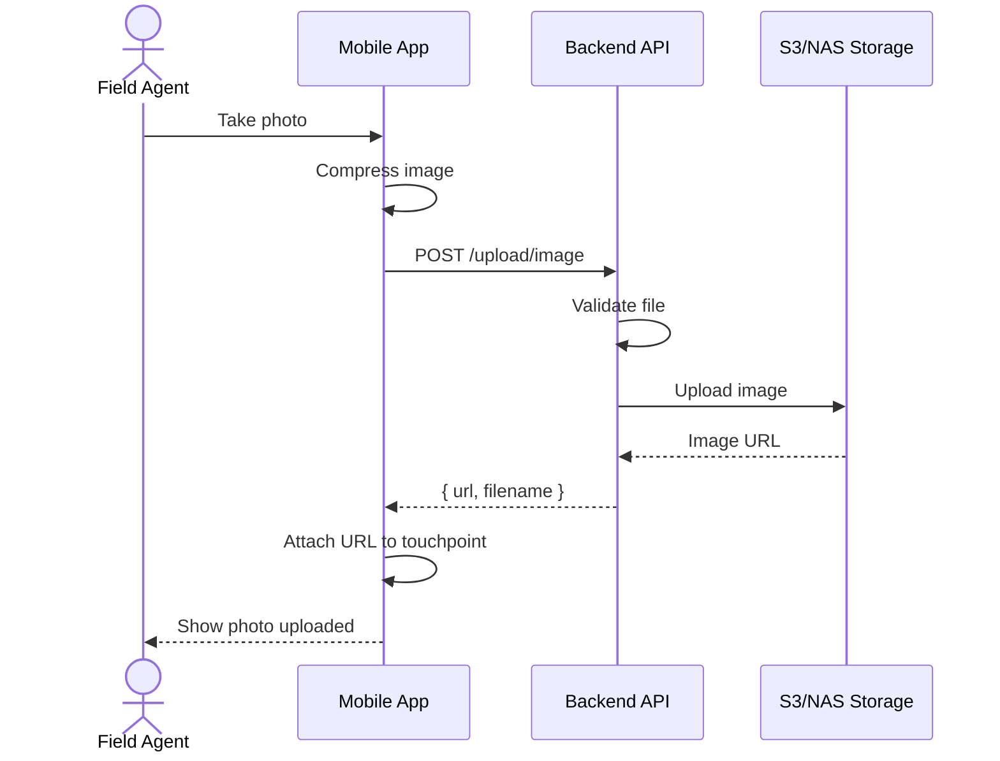

---

## Analytics Data Flow

### Dashboard Data Aggregation

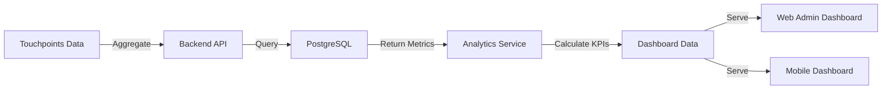

### KPI Calculation Flow

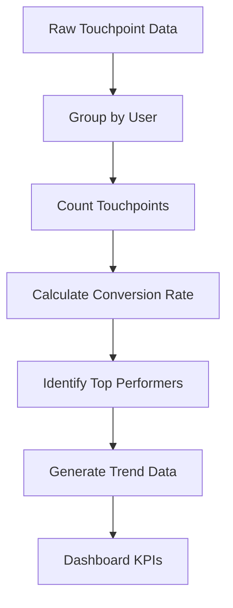

---

## Real-time Data Flow

### WebSocket Communication (Planned)

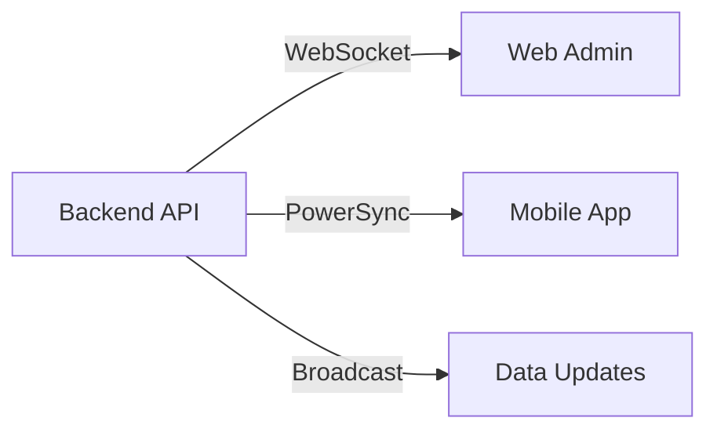

### Push Notification Flow (Planned)

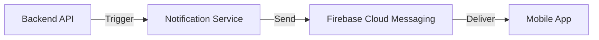

---

## Data Validation Flow

### Request Validation Flow

```mermaid
flowchart TD
    A[Incoming Request] --> B{Has Body?}
    B -->|Yes| C[Parse JSON]
    B -->|No| D[Query Params Only]
    C --> E[Zod Validation]
    D --> E
    E --> F{Valid?}
    F -->|Yes| G[Process Request]
    F -->|No| H[Return 400 Error]
```

### Touchpoint Validation Flow

```mermaid
flowchart TD
    A[Create Touchpoint Request] --> B{User Role?}
    B -->|Caravan| C{Touchpoint Type?}
    B -->|Tele| D{Touchpoint Type?}
    B -->|Admin| E[Allow All]
    C -->|Visit| F{Number in 1,4,7?}
    C -->|Call| G[Reject]
    D -->|Call| H{Number in 2,3,5,6?}
    D -->|Visit| I[Reject]
    F -->|Yes| J[Allow]
    F -->|No| G
    H -->|Yes| J
    H -->|No| I
    E --> K[Validate Other Fields]
    J --> K
    G --> L[Return 403 Error]
    I --> L
    K --> M{All Valid?}
    M -->|Yes| N[Create Touchpoint]
    M -->|No| O[Return 400 Error]
```

---

## Data Export Flow

### Report Generation Flow

```mermaid
sequenceDiagram
    actor A as Admin
    participant W as Web Admin
    participant API as Backend API
    participant DB as PostgreSQL

    A->>W: Request report
    W->>API: GET /reports/clients
    API->>DB: Query clients
    DB-->>API: Client data
    API->>API: Generate CSV
    API-->>W: CSV file
    W-->>A: Download report
```

---

## Data Caching Flow

### Mobile Caching Strategy

```mermaid
flowchart TD
    A[Request Data] --> B{In Local Cache?}
    B -->|Yes| C[Return Cached Data]
    B -->|No| D[Fetch from API]
    D --> E[Store in Cache]
    E --> F[Return Data]
    C --> G{Cache Expired?}
    G -->|Yes| D
    G -->|No| H[Use Cached Data]
```

### Web Admin Caching

```mermaid
flowchart TD
    A[Request Data] --> B{In Pinia Store?}
    B -->|Yes| C{Data Fresh?}
    B -->|No| D[Fetch from API]
    C -->|Yes| E[Return Store Data]
    C -->|No| D
    D --> F[Update Store]
    F --> G[Return Data]
```

---

## Data Integrity Flow

### Transaction Management

```mermaid
flowchart TD
    A[Begin Transaction] --> B[Execute Operations]
    B --> C{All Operations Success?}
    C -->|Yes| D[Commit Transaction]
    C -->|No| E[Rollback Transaction]
    D --> F[Data Persisted]
    E --> G[Changes Discarded]
```

### Audit Logging Flow

```mermaid
flowchart LR
    A[Data Change] -->|Log| B[Audit Middleware]
    B -->|Insert| C[Audit Logs Table]
    C -->|Query| D[Audit Reports]
```

---

## Data Migration Flow

### Client Import Flow

```mermaid
flowchart TD
    A[Upload CSV] --> B[Parse CSV]
    B --> C[Validate Data]
    C --> D{Valid?}
    D -->|No| E[Show Errors]
    D -->|Yes| F[Create Clients]
    F --> G[Assign to Agency]
    G --> H[Assign to Users]
    H --> I[Generate Itineraries]
    I --> J[Import Complete]
```

---

## Data Backup Flow

### Database Backup Flow

```mermaid
flowchart LR
    A[PostgreSQL] -->|Daily Backup| B[Backup Service]
    B -->|Store| C[S3 / NAS]
    C -->|Retention Policy| D[7 Days]
    D -->|Restore| E[Disaster Recovery]
```

---

**Last Updated:** 2026-04-02
