# State Machines

> **IMU State Machines** - Authentication, touchpoint, and sync state diagrams

---

## Authentication State Machine

### Mobile App Authentication Flow

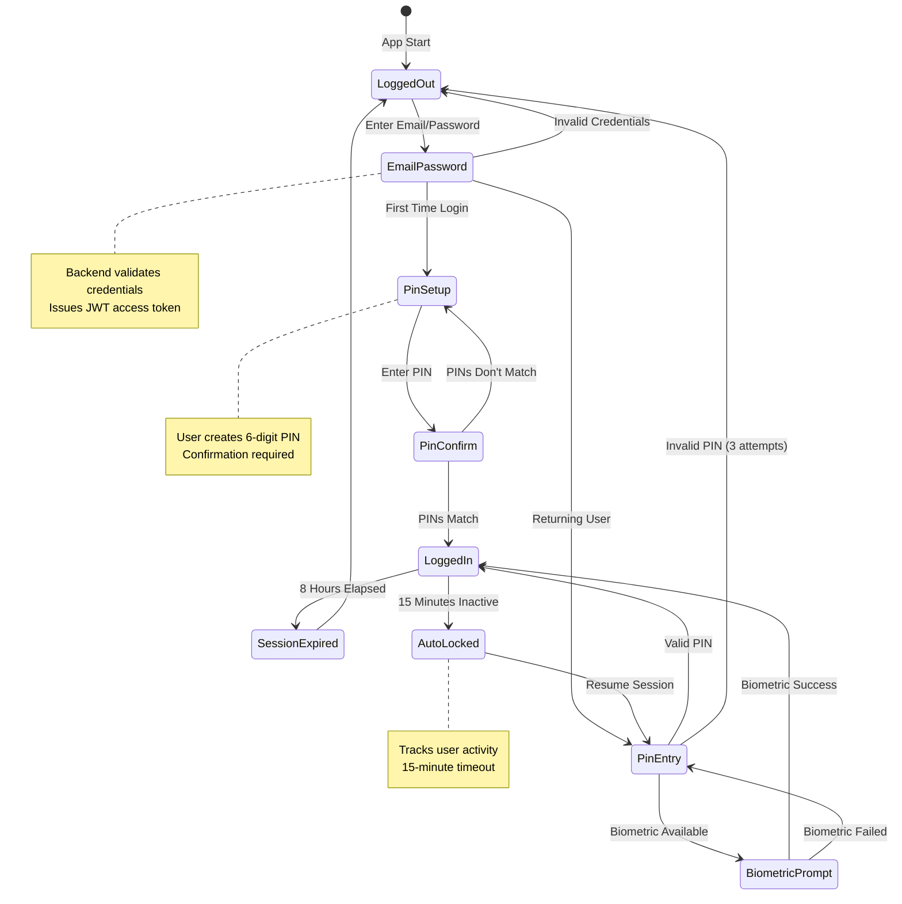
```mermaid
stateDiagram-v2
    [*] --> LoggedOut: App Start

    LoggedOut --> EmailPassword: Enter Email/Password
    EmailPassword --> PinSetup: First Time Login
    EmailPassword --> PinEntry: Returning User
    EmailPassword --> LoggedOut: Invalid Credentials

    PinSetup --> PinConfirm: Enter PIN
    PinConfirm --> LoggedIn: PINs Match
    PinConfirm --> PinSetup: PINs Don't Match

    PinEntry --> LoggedIn: Valid PIN
    PinEntry --> BiometricPrompt: Biometric Available
    PinEntry --> LoggedOut: Invalid PIN (3 attempts)

    BiometricPrompt --> LoggedIn: Biometric Success
    BiometricPrompt --> PinEntry: Biometric Failed

    LoggedIn --> SessionExpired: 8 Hours Elapsed
    LoggedIn --> AutoLocked: 15 Minutes Inactive

    SessionExpired --> LoggedOut
    AutoLocked --> PinEntry: Resume Session

    note right of EmailPassword
        Backend validates credentials
        Issues JWT access token
    end note

    note right of PinSetup
        User creates 6-digit PIN
        Confirmation required
    end note

    note right of AutoLocked
        Tracks user activity
        15-minute timeout
    end note
```

### Web Admin Authentication Flow

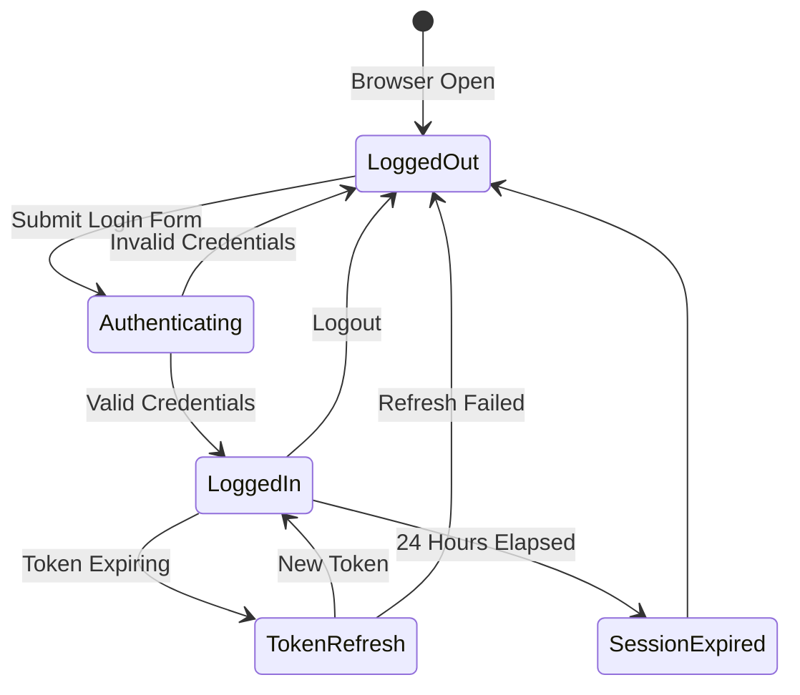
```mermaid
stateDiagram-v2
    [*] --> LoggedOut: Browser Open

    LoggedOut --> Authenticating: Submit Login Form
    Authenticating --> LoggedIn: Valid Credentials
    Authenticating --> LoggedOut: Invalid Credentials

    LoggedIn --> TokenRefresh: Token Expiring
    LoggedIn --> LoggedOut: Logout

    TokenRefresh --> LoggedIn: New Token
    TokenRefresh --> LoggedOut: Refresh Failed

    LoggedIn --> SessionExpired: 24 Hours Elapsed
    SessionExpired --> LoggedOut
```

---

## Permission State Machine

### Mobile Permission Flow

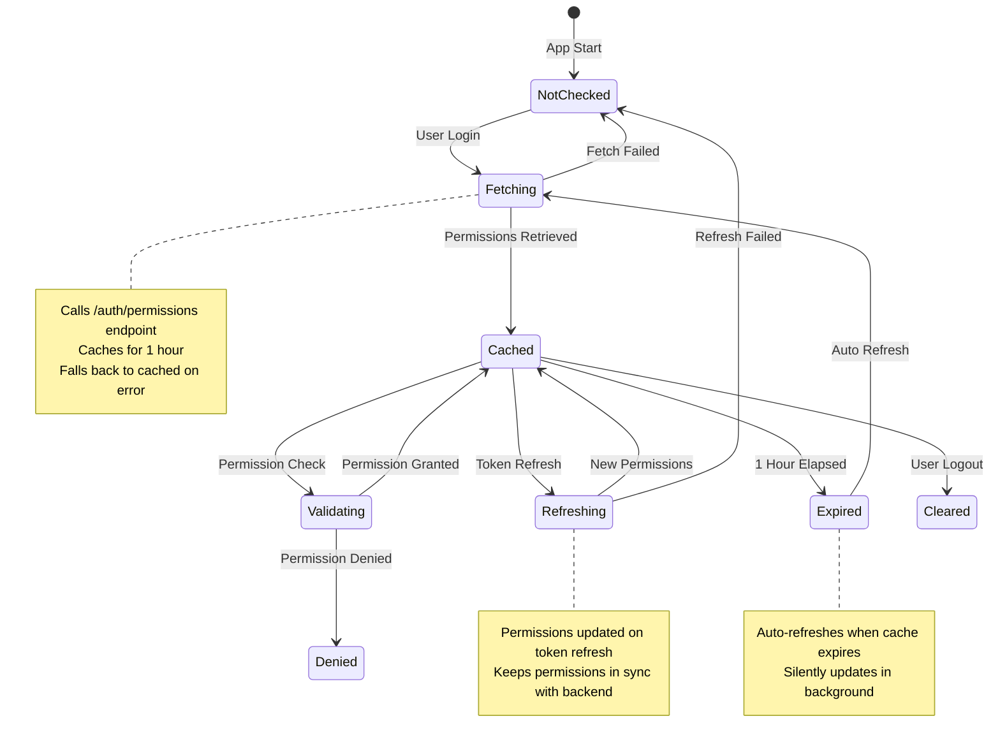
```mermaid
stateDiagram-v2
    [*] --> NotChecked: App Start

    NotChecked --> Fetching: User Login
    Fetching --> Cached: Permissions Retrieved
    Fetching --> NotChecked: Fetch Failed

    Cached --> Validating: Permission Check
    Validating --> Cached: Permission Granted
    Validating --> Denied: Permission Denied

    Cached --> Refreshing: Token Refresh
    Refreshing --> Cached: New Permissions
    Refreshing --> NotChecked: Refresh Failed

    Cached --> Expired: 1 Hour Elapsed
    Expired --> Fetching: Auto Refresh

    Cached --> Cleared: User Logout

    note right of Fetching
        Calls /auth/permissions endpoint
        Caches for 1 hour
        Falls back to cached on error
    end note

    note right of Refreshing
        Permissions updated on token refresh
        Keeps permissions in sync with backend
    end note

    note right of Expired
        Auto-refreshes when cache expires
        Silently updates in background
    end note
```

### Permission Check Flow

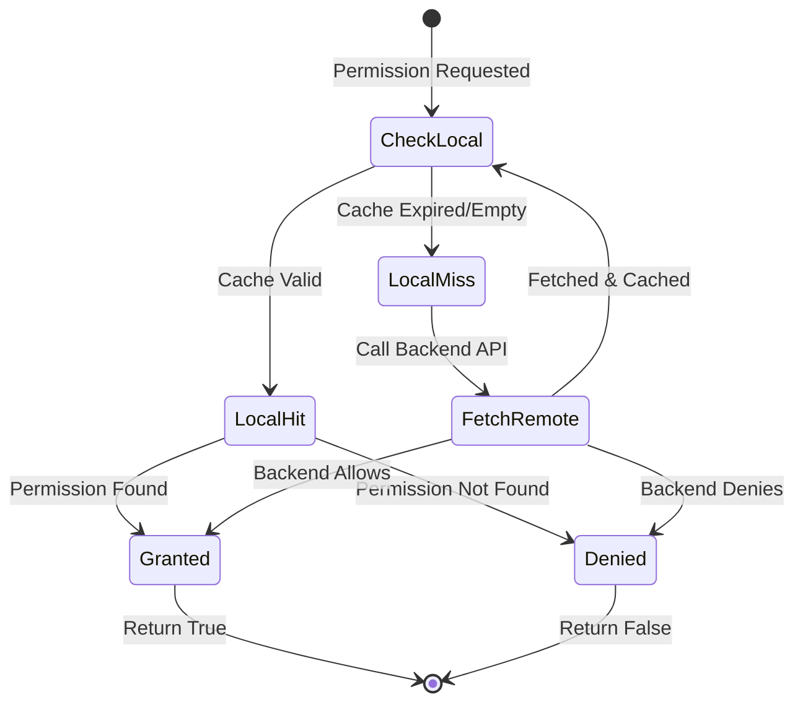
```mermaid
stateDiagram-v2
    [*] --> CheckLocal: Permission Requested

    CheckLocal --> LocalHit: Cache Valid
    CheckLocal --> LocalMiss: Cache Expired/Empty

    LocalHit --> Granted: Permission Found
    LocalHit --> Denied: Permission Not Found

    LocalMiss --> FetchRemote: Call Backend API
    FetchRemote --> Granted: Backend Allows
    FetchRemote --> Denied: Backend Denies
    FetchRemote --> CheckLocal: Fetched & Cached

    Granted --> [*]: Return True
    Denied --> [*]: Return False
```

### Area Filter State Machine

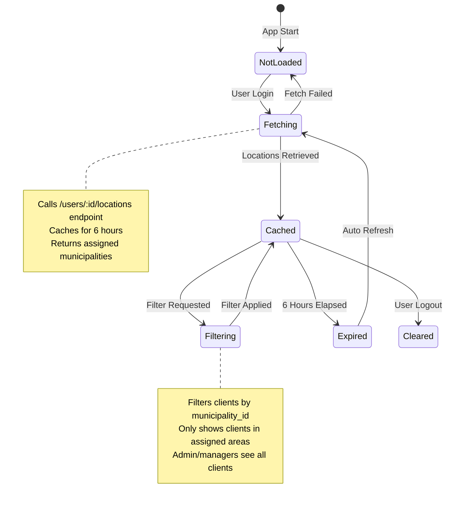
```mermaid
stateDiagram-v2
    [*] --> NotLoaded: App Start

    NotLoaded --> Fetching: User Login
    Fetching --> Cached: Locations Retrieved
    Fetching --> NotLoaded: Fetch Failed

    Cached --> Filtering: Filter Requested
    Filtering --> Cached: Filter Applied

    Cached --> Expired: 6 Hours Elapsed
    Expired --> Fetching: Auto Refresh

    Cached --> Cleared: User Logout

    note right of Fetching
        Calls /users/:id/locations endpoint
        Caches for 6 hours
        Returns assigned municipalities
    end note

    note right of Filtering
        Filters clients by municipality_id
        Only shows clients in assigned areas
        Admin/managers see all clients
    end note
```

---

## Touchpoint State Machine

### Touchpoint Creation Flow

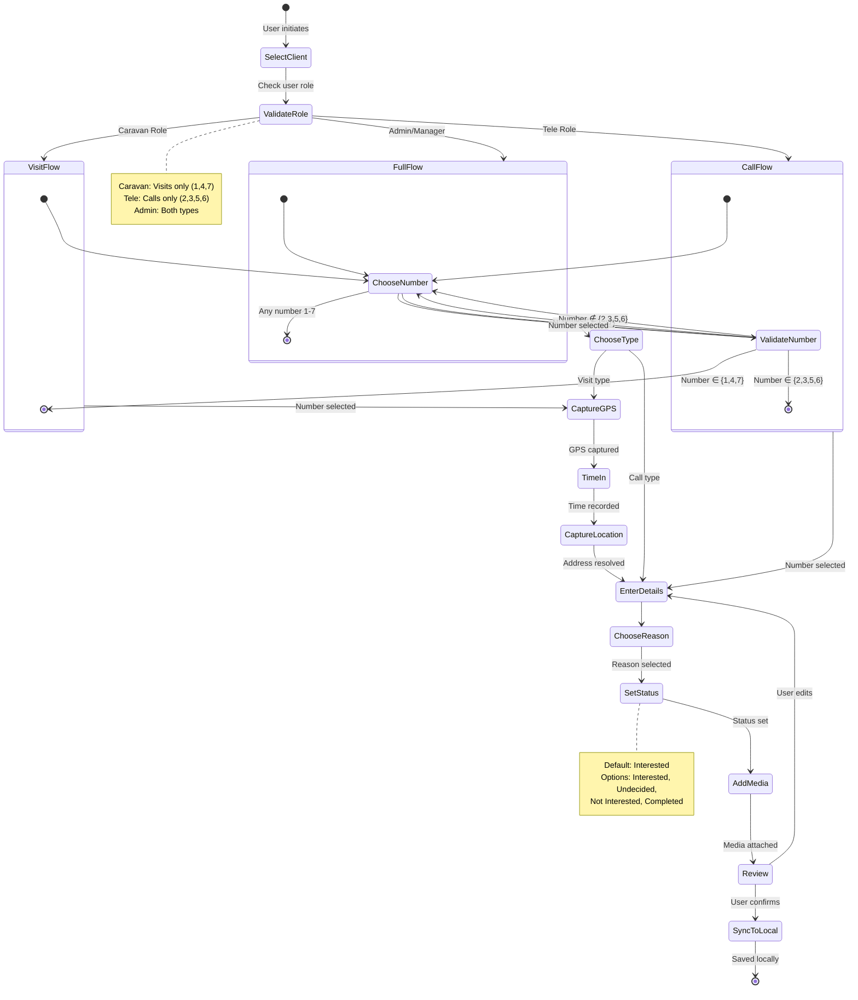
```mermaid
stateDiagram-v2
    [*] --> SelectClient: User initiates

    SelectClient --> ValidateRole: Check user role

    ValidateRole --> VisitFlow: Caravan Role
    ValidateRole --> CallFlow: Tele Role
    ValidateRole --> FullFlow: Admin/Manager

    state VisitFlow {
        [*] --> ChooseNumber
        ChooseNumber --> ValidateNumber
        ValidateNumber --> [*]: Number ∈ {1,4,7}
        ValidateNumber --> ChooseNumber: Number ∉ {1,4,7}
    }

    state CallFlow {
        [*] --> ChooseNumber
        ChooseNumber --> ValidateNumber
        ValidateNumber --> [*]: Number ∈ {2,3,5,6}
        ValidateNumber --> ChooseNumber: Number ∉ {2,3,5,6}
    }

    state FullFlow {
        [*] --> ChooseNumber
        ChooseNumber --> [*]: Any number 1-7
    }

    VisitFlow --> CaptureGPS: Number selected
    CallFlow --> EnterDetails: Number selected
    FullFlow --> ChooseType: Number selected

    CaptureGPS --> TimeIn: GPS captured
    TimeIn --> CaptureLocation: Time recorded
    CaptureLocation --> EnterDetails: Address resolved

    EnterDetails --> ChooseReason
    ChooseReason --> SetStatus: Reason selected
    SetStatus --> AddMedia: Status set
    AddMedia --> Review: Media attached

    ChooseType --> CaptureGPS: Visit type
    ChooseType --> EnterDetails: Call type

    Review --> SyncToLocal: User confirms
    Review --> EnterDetails: User edits

    SyncToLocal --> [*]: Saved locally

    note right of ValidateRole
        Caravan: Visits only (1,4,7)
        Tele: Calls only (2,3,5,6)
        Admin: Both types
    end note

    note right of SetStatus
        Default: Interested
        Options: Interested, Undecided,
        Not Interested, Completed
    end note
```

### Touchpoint Status Transitions

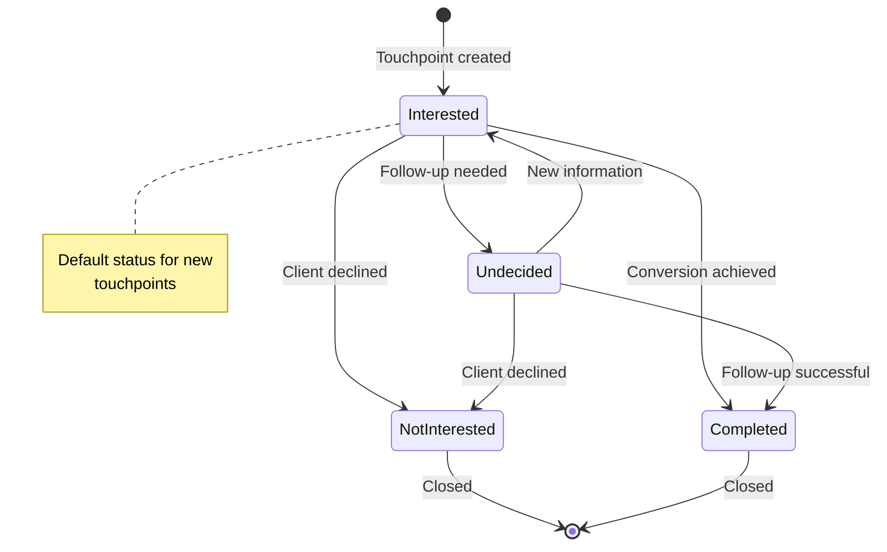
```mermaid
stateDiagram-v2
    [*] --> Interested: Touchpoint created
    Interested --> Undecided: Follow-up needed
    Interested --> Completed: Conversion achieved
    Interested --> NotInterested: Client declined

    Undecided --> Interested: New information
    Undecided --> Completed: Follow-up successful
    Undecided --> NotInterested: Client declined

    NotInterested --> [*]: Closed
    Completed --> [*]: Closed

    note right of Interested
        Default status for new
        touchpoints
    end note
```

---

## Data Synchronization State Machine

### PowerSync Sync Flow

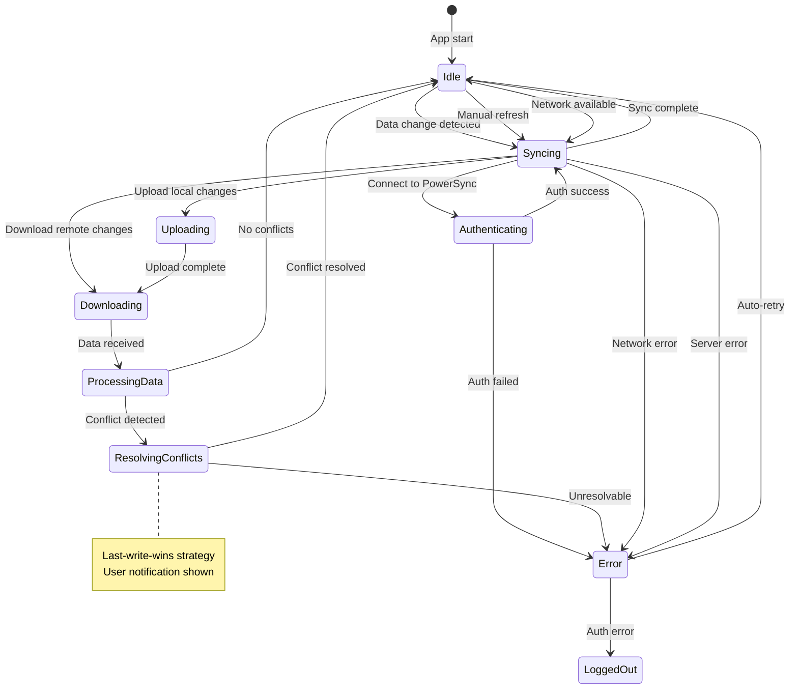
```mermaid
stateDiagram-v2
    [*] --> Idle: App start

    Idle --> Syncing: Data change detected
    Idle --> Syncing: Manual refresh
    Idle --> Syncing: Network available

    Syncing --> Authenticating: Connect to PowerSync
    Authenticating --> Syncing: Auth success
    Authenticating --> Error: Auth failed

    Syncing --> Uploading: Upload local changes
    Syncing --> Downloading: Download remote changes

    Uploading --> Downloading: Upload complete
    Downloading --> ProcessingData: Data received

    ProcessingData --> ResolvingConflicts: Conflict detected
    ProcessingData --> Idle: No conflicts

    ResolvingConflicts --> Idle: Conflict resolved
    ResolvingConflicts --> Error: Unresolvable

    Syncing --> Idle: Sync complete
    Syncing --> Error: Network error
    Syncing --> Error: Server error

    Error --> Idle: Auto-retry
    Error --> LoggedOut: Auth error

    note right of ResolvingConflicts
        Last-write-wins strategy
        User notification shown
    end note
```

### Sync States (Mobile)

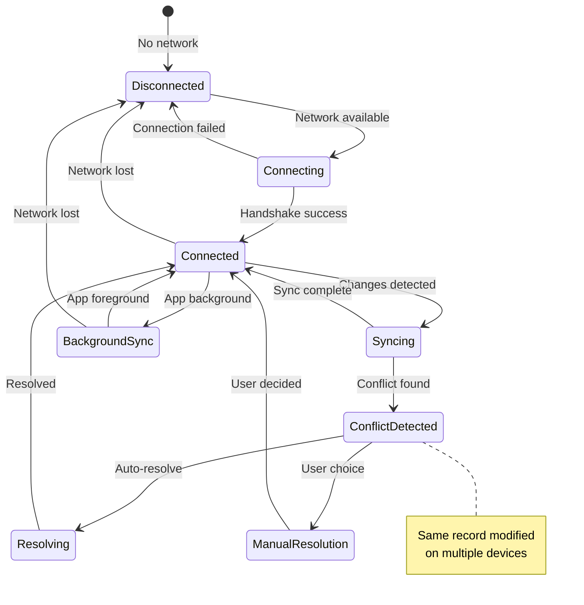
```mermaid
stateDiagram-v2
    [*] --> Disconnected: No network

    Disconnected --> Connecting: Network available
    Connecting --> Connected: Handshake success
    Connecting --> Disconnected: Connection failed

    Connected --> Syncing: Changes detected
    Syncing --> Connected: Sync complete
    Syncing --> ConflictDetected: Conflict found

    ConflictDetected --> Resolving: Auto-resolve
    ConflictDetected --> ManualResolution: User choice

    Resolving --> Connected: Resolved
    ManualResolution --> Connected: User decided

    Connected --> Disconnected: Network lost
    Connected --> BackgroundSync: App background

    BackgroundSync --> Connected: App foreground
    BackgroundSync --> Disconnected: Network lost

    note right of ConflictDetected
        Same record modified
        on multiple devices
    end note
```

---

## Client State Machine

### Client Lifecycle

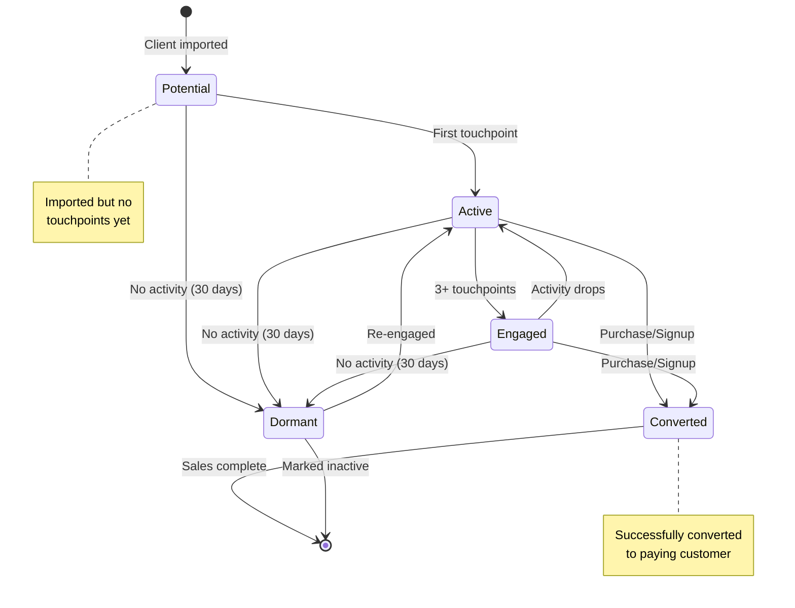
```mermaid
stateDiagram-v2
    [*] --> Potential: Client imported
    Potential --> Active: First touchpoint
    Potential --> Dormant: No activity (30 days)

    Active --> Engaged: 3+ touchpoints
    Active --> Dormant: No activity (30 days)
    Active --> Converted: Purchase/Signup

    Engaged --> Active: Activity drops
    Engaged --> Converted: Purchase/Signup
    Engaged --> Dormant: No activity (30 days)

    Converted --> [*]: Sales complete
    Dormant --> Active: Re-engaged
    Dormant --> [*]: Marked inactive

    note right of Potential
        Imported but no
        touchpoints yet
    end note

    note right of Converted
        Successfully converted
        to paying customer
    end note
```

---

## Approval Workflow State Machine

### Touchpoint Approval (if applicable)

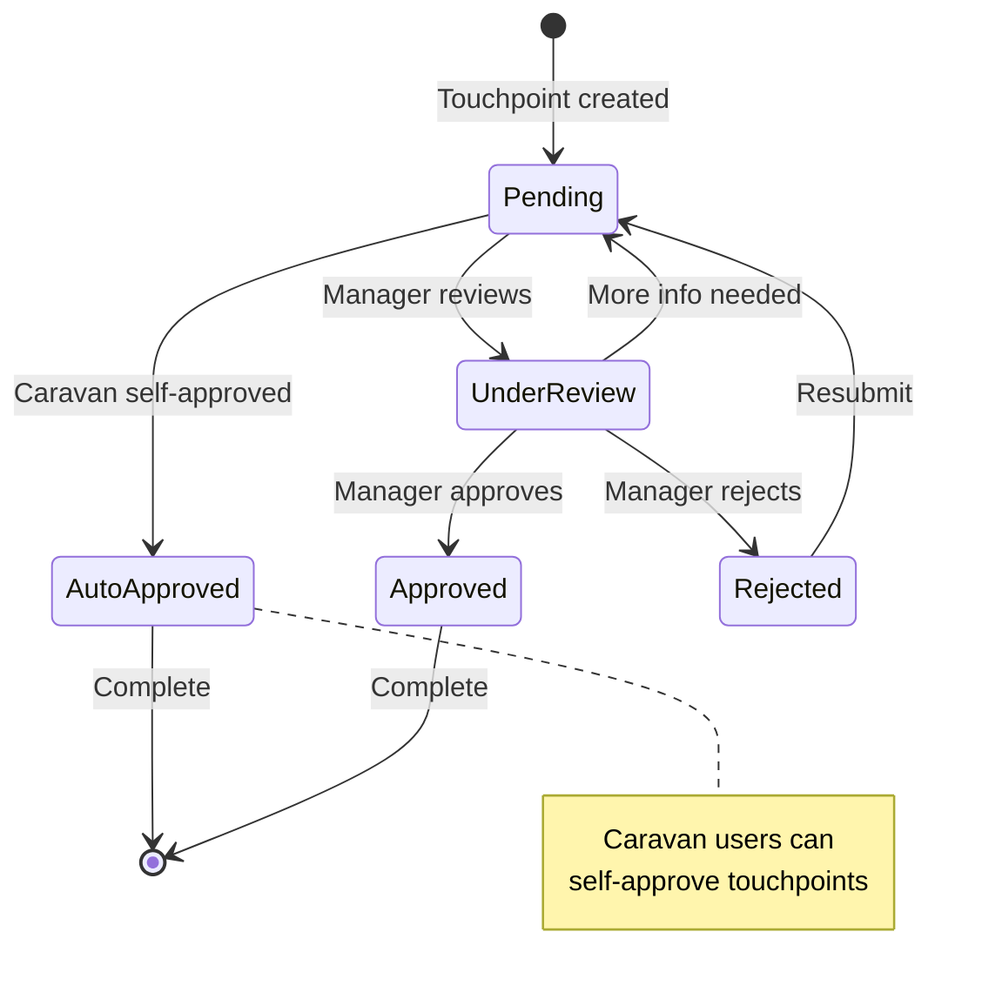
```mermaid
stateDiagram-v2
    [*] --> Pending: Touchpoint created

    Pending --> UnderReview: Manager reviews
    Pending --> AutoApproved: Caravan self-approved

    UnderReview --> Approved: Manager approves
    UnderReview --> Rejected: Manager rejects
    UnderReview --> Pending: More info needed

    AutoApproved --> [*]: Complete
    Approved --> [*]: Complete
    Rejected --> Pending: Resubmit

    note right of AutoApproved
        Caravan users can
        self-approve touchpoints
    end note
```

---

## Itinerary State Machine

### Daily Itinerary Flow

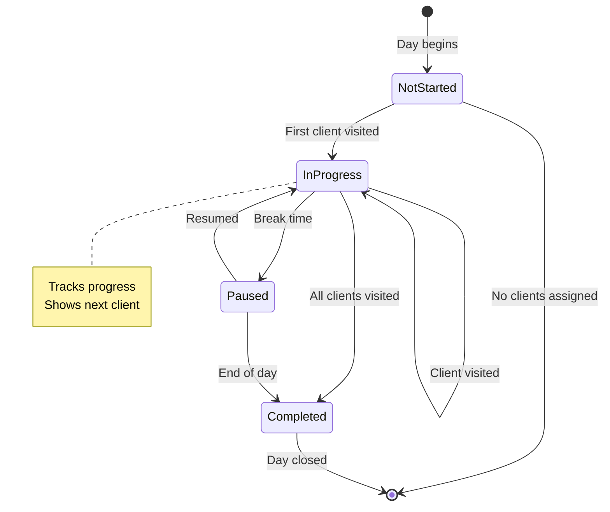
```mermaid
stateDiagram-v2
    [*] --> NotStarted: Day begins

    NotStarted --> InProgress: First client visited
    NotStarted --> [*]: No clients assigned

    InProgress --> InProgress: Client visited
    InProgress --> Paused: Break time
    InProgress --> Completed: All clients visited

    Paused --> InProgress: Resumed
    Paused --> Completed: End of day

    Completed --> [*]: Day closed

    note right of InProgress
        Tracks progress
        Shows next client
    end note
```

---

## Upload State Machine

### File Upload Flow

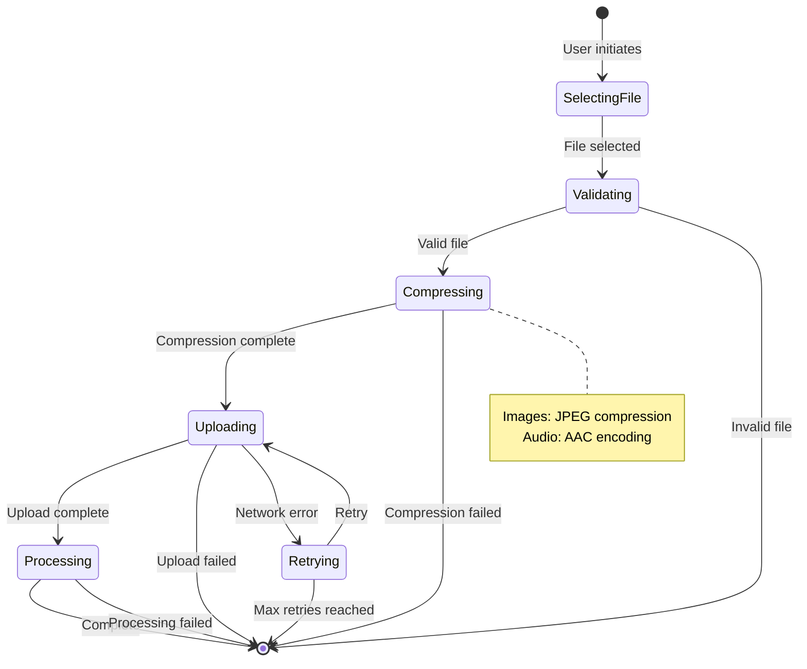
```mermaid
stateDiagram-v2
    [*] --> SelectingFile: User initiates

    SelectingFile --> Validating: File selected
    Validating --> Compressing: Valid file
    Validating --> [*]: Invalid file

    Compressing --> Uploading: Compression complete
    Compressing --> [*]: Compression failed

    Uploading --> Processing: Upload complete
    Uploading --> [*]: Upload failed
    Uploading --> Retrying: Network error

    Retrying --> Uploading: Retry
    Retrying --> [*]: Max retries reached

    Processing --> [*]: Complete
    Processing --> [*]: Processing failed

    note right of Compressing
        Images: JPEG compression
        Audio: AAC encoding
    end note
```

---

## GPS Tracking State Machine

### Location Tracking Flow

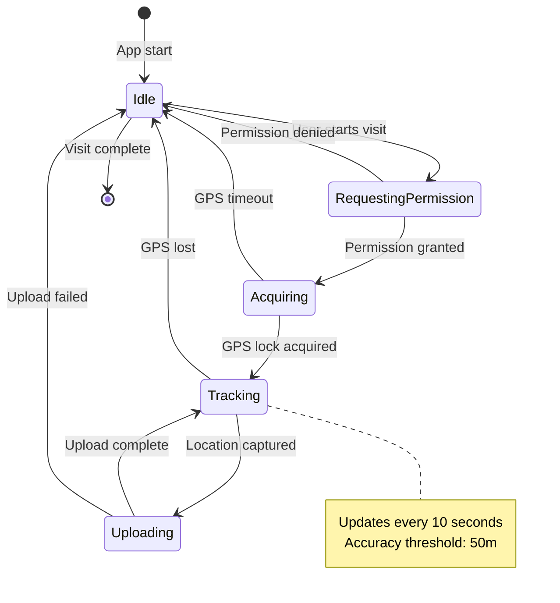
```mermaid
stateDiagram-v2
    [*] --> Idle: App start

    Idle --> RequestingPermission: User starts visit
    RequestingPermission --> Idle: Permission denied
    RequestingPermission --> Acquiring: Permission granted

    Acquiring --> Tracking: GPS lock acquired
    Acquiring --> Idle: GPS timeout

    Tracking --> Uploading: Location captured
    Tracking --> Idle: GPS lost

    Uploading --> Tracking: Upload complete
    Uploading --> Idle: Upload failed

    Idle --> [*]: Visit complete

    note right of Tracking
        Updates every 10 seconds
        Accuracy threshold: 50m
    end note
```

---

## Error State Handling

### Global Error States

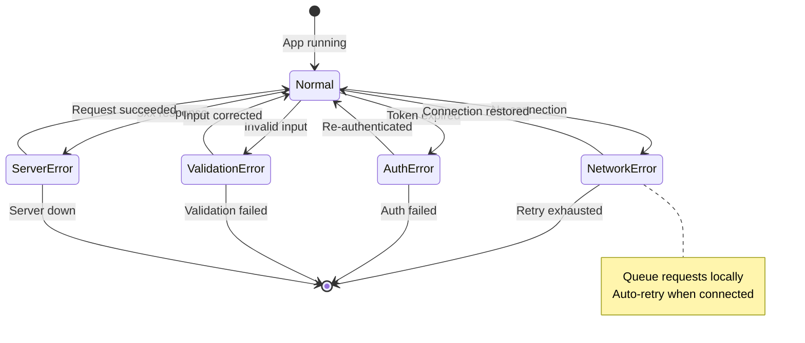
```mermaid
stateDiagram-v2
    [*] --> Normal: App running

    Normal --> NetworkError: No connection
    Normal --> AuthError: Token expired
    Normal --> ValidationError: Invalid input
    Normal --> ServerError: 5xx response

    NetworkError --> Normal: Connection restored
    NetworkError --> [*]: Retry exhausted

    AuthError --> Normal: Re-authenticated
    AuthError --> [*]: Auth failed

    ValidationError --> Normal: Input corrected
    ValidationError --> [*]: Validation failed

    ServerError --> Normal: Request succeeded
    ServerError --> [*]: Server down

    note right of NetworkError
        Queue requests locally
        Auto-retry when connected
    end note
```

---

## State Persistence

### Local Storage (Hive)

**Persisted States:**
- User session (PIN, biometric setting)
- Last sync timestamp
- Cached clients (assigned area only)
- Pending touchpoints (unsynced)
- GPS coordinates (last known)

**Retention:**
- User session: 8 hours
- Cached data: 7 days
- Pending changes: Until synced

### PowerSync Database

**Synchronized Tables:**
- `clients` - Client records
- `users` - User profiles
- `touchpoints` - Touchpoint records
- `itineraries` - Daily schedules
- `agencies` - Organization structure

**Query Observation:**
- Reactive queries auto-update
- UI updates on sync completion
- Background sync transparent

---

## State Transitions Summary

| State Machine | States | Triggers | Actions |
|---------------|--------|----------|---------|
| **Auth (Mobile)** | 7 states | Login, PIN, biometric | Issue/revoke token |
| **Auth (Web)** | 4 states | Login, token refresh | Update session |
| **Touchpoint** | 10 states | Role, number, status | Validate, save |
| **Sync** | 8 states | Data change, network | Upload/download |
| **Client** | 7 states | Activity, conversion | Update status |
| **GPS** | 5 states | Visit start/stop | Track location |

---

**Last Updated:** 2026-04-02
