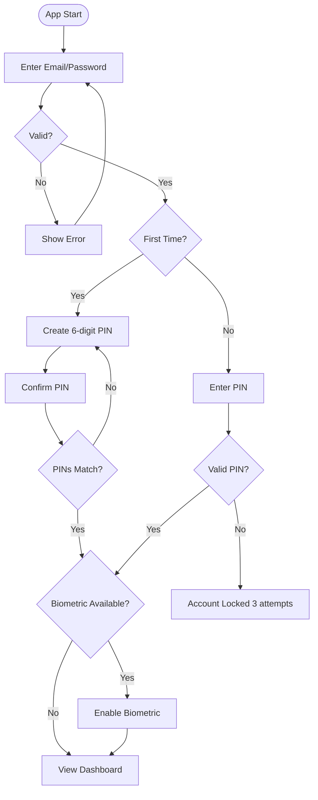
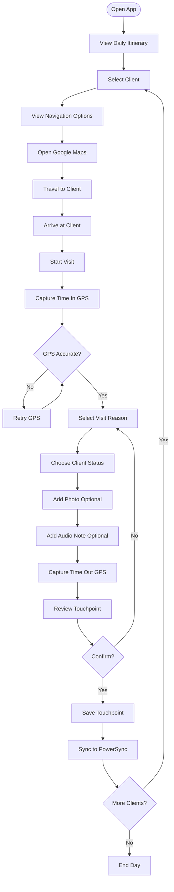
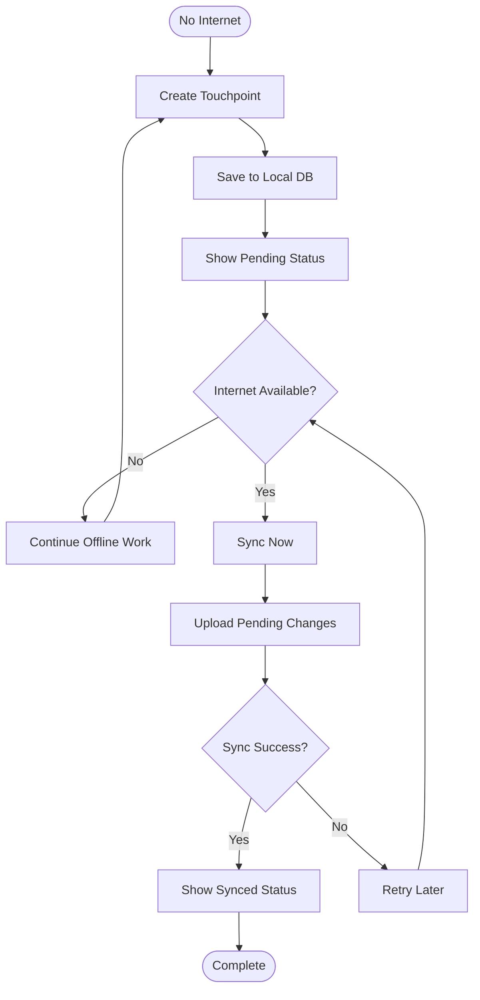
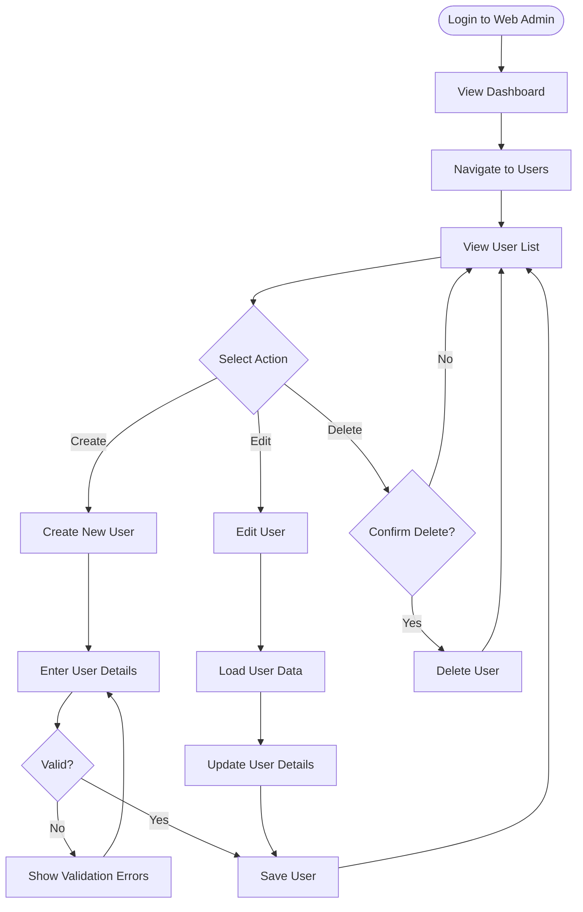
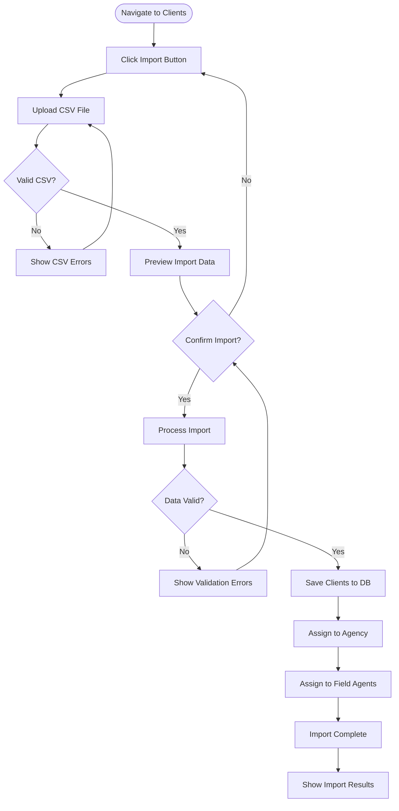
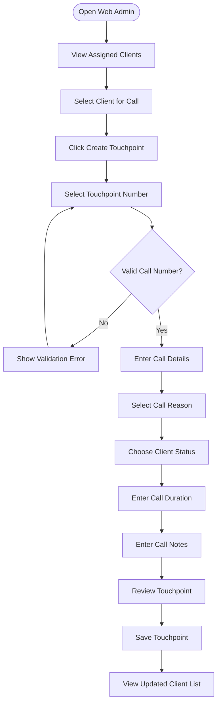

# User Flows

> **IMU User Journey Flows** - Detailed user interaction flows

---

## Field Agent (Caravan) Flows

### Flow 1: First-Time Login



**Steps:**
1. User opens mobile app
2. Enters email and password
3. Backend validates credentials
4. If first-time user: Setup 6-digit PIN
5. If returning user: Enter PIN
6. Optional: Enable biometric authentication
7. Navigate to dashboard

**Error Handling:**
- Invalid credentials: Show error message
- PIN mismatch: Ask to re-enter
- 3 failed PIN attempts: Lock account
- Network error: Queue for retry

---

### Flow 2: Daily Client Visit



**Steps:**
1. View daily itinerary
2. Select client to visit
3. Open navigation (Google Maps)
4. Travel to client location
5. Arrive and start visit
6. Capture GPS location (time in)
7. Select visit reason
8. Choose client status
9. Optionally add photo
10. Optionally add audio note
11. Capture GPS location (time out)
12. Review and confirm
13. Save touchpoint
14. Sync to PowerSync
15. Continue to next client

**Validation:**
- GPS accuracy must be < 50m
- Touchpoint number must be valid for role (Caravan: 1, 4, 7)
- All required fields must be filled

---

### Flow 3: Offline Touchpoint Creation



**Steps:**
1. Create touchpoint without internet
2. Save to local PowerSync database
3. Show pending sync indicator
4. When internet available: auto-sync
5. Upload all pending changes
6. Show synced status

**Offline Features:**
- View assigned clients
- Create touchpoints
- View itinerary
- Limited functionality without sync

---

## Administrator Flows

### Flow 4: User Management



**Steps:**
1. Login to web admin
2. Navigate to Users section
3. Choose action: Create, Edit, Delete
4. For Create: Enter user details and save
5. For Edit: Load user, update details, save
6. For Delete: Confirm deletion
7. View updated user list

**Validation:**
- Email must be unique
- Role must be valid
- Required fields must be filled
- Password requirements for new users

---

### Flow 5: Client Import



**Steps:**
1. Navigate to Clients section
2. Click Import button
3. Upload CSV file
4. Validate CSV format
5. Preview import data
6. Confirm import
7. Process and validate data
8. Save clients to database
9. Assign to agency and users
10. Show import results

**CSV Format:**
```csv
first_name,middle_name,last_name,client_type,product_type,market_type,pension_type,street,barangay,city_municipality,province,region,postal_code,phone_type,phone_number
```

---

## Tele Agent Flows

### Flow 6: Call Touchpoint Creation



**Steps:**
1. Open web admin
2. View assigned clients
3. Select client for call
4. Click create touchpoint
5. Select call touchpoint number (2, 3, 5, 6)
6. Enter call details
7. Select call reason
8. Choose client status
9. Enter call duration
10. Add call notes
11. Save touchpoint

**Validation:**
- Tele role can only create call touchpoints (2, 3, 5, 6)
- Call duration must be positive
- All required fields must be filled

---

## Common User Flow Elements

### Navigation Patterns

**Mobile App Navigation:**
- Bottom navigation bar
- Main sections: Home, Clients, Itinerary, Profile
- Back button for navigation hierarchy
- Deep linking for notifications

**Web Admin Navigation:**
- Sidebar navigation
- Main sections: Dashboard, Users, Clients, Agencies, Reports
- Breadcrumbs for navigation hierarchy
- Role-based menu items

### Data Entry Patterns

**Mobile Data Entry:**
- Form validation at field level
- Progress indicators for multi-step forms
- Auto-save for long forms
- Confirmation dialogs for destructive actions

**Web Data Entry:**
- Inline validation
- Modal dialogs for forms
- Table-based data entry
- Bulk operations available

### Error Handling Patterns

**Common Error States:**
- Network errors: Retry option
- Validation errors: Inline messages
- Authentication errors: Redirect to login
- Server errors: Contact support message

---

## User Flow Optimization

### Performance Considerations

**Mobile:**
- Lazy load client lists
- Cache frequently accessed data
- Optimize image sizes
- Minimize sync data

**Web:**
- Pagination for large lists
- Debounce search inputs
- Virtual scrolling for tables
- Lazy load images

### Accessibility

**Mobile:**
- Minimum touch target size: 48x48dp
- Color contrast ratio: 4.5:1
- Screen reader support
- Haptic feedback for actions

**Web:**
- Keyboard navigation support
- ARIA labels for screen readers
- Focus indicators
- Error announcements

---

**Last Updated:** 2026-04-02
